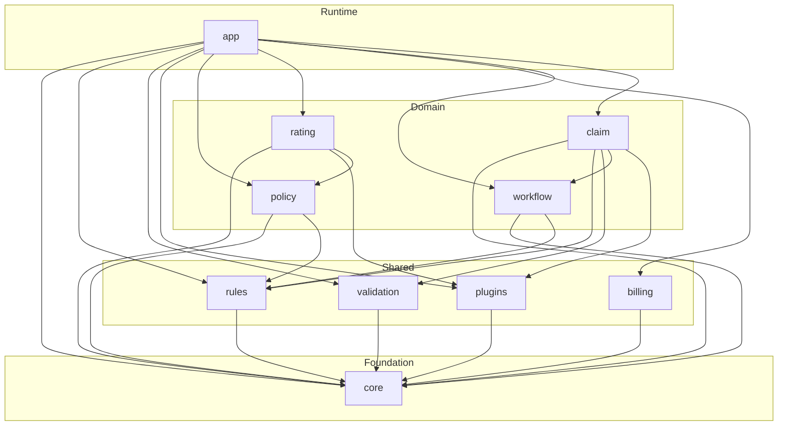

# Open Insurance Engine

A Property & Casualty (P&C) insurance core engine for financial and insurance carriers, built with **Scala 3**, **Cats Effect**, **FS2**, and in near future **Apache Kafka**.

Architecture inspired by the typical domain ecosystem with below generic modules like: `PolicyCenter`, `BillingCenter`, `ClaimCenter`. 

## Modules

| Module | Role |
|--------|------|
| `core` | Opaque IDs, Money (minor units), Time, Result, in-memory `Repository` |
| `rules` | Business rules engine (Accept / Reject / Modify / Refer) |
| `validation` | Accumulating field validation (`ValidatedNel`) |
| `plugins` | Plugin SPI (rating, underwriting, payments, fraud, documents...) |
| `policy` | New business: draft -> quote -> bind -> cancel |
| `rating` | Weighted / multiplicative rate engine, rate tables, worksheets, Personal Auto plan |
| `billing` | BillingCenter: installment invoices, bill, apply payment |
| `workflow` | Generic process engine: steps, transitions, guards, instance history |
| `claim` | ClaimCenter: FNOL, reserves, approve, pay, close / deny |
| `app` | Composition root and demo: submission workflow + rating + FNOL |

### Module dependencies

Arrows mean **depends on** (sbt `dependsOn`). `core` is the shared foundation; `app` is the composition root.



## Requirements

- JDK 17+
- sbt 1.10+

## Running demo app

The demo binds a Personal Auto policy through the submission workflow (`draft -> rate -> underwrite -> quote -> bind`), then opens a collision FNOL and settles it (`open -> reserve -> approve -> pay -> close`).

```bash
sbt "app/run --demo"
```

```
[info] Starting demo scenario on 2026-08-14...
[info] 20:55:56.445 [io-compute-11] INFO  c.g.b.openinsuranceengine.app.Main - Insured: age=23, licensed=3y, claims=1, credit=Standard, region=PL-MZ
[info] 20:55:56.449 [io-compute-11] INFO  c.g.b.openinsuranceengine.app.Main - === New-business workflow: New Business Submission ===
[info] 20:55:56.456 [io-compute-11] INFO  c.g.b.openinsuranceengine.app.Main - Workflow step: draft
[info] 20:55:56.462 [io-compute-11] INFO  c.g.b.openinsuranceengine.app.Main - Workflow step: rate
[info] 20:55:56.524 [io-compute-11] INFO  c.g.b.openinsuranceengine.app.Main - Workflow step: underwrite
[info] 20:55:56.544 [io-compute-11] INFO  c.g.b.openinsuranceengine.app.Main - Workflow step: quote
[info] 20:55:56.545 [io-compute-11] INFO  c.g.b.openinsuranceengine.app.Main - Workflow step: bind
[info] Created Account: 4a68c77c-5140-4f8e-a4f8-118d4158bc3f, Party: 347b30f5-9192-4d7e-9891-678be9c58196
[info] Product ID: 7a0f1f16-12b9-41fc-9723-c7431dde63c1, Policy ID: 40571cf1-ab7d-4659-94e7-36fe6c236756
[info] Coverage: BI (Base Premium: 1000,00 PLN)
[info] Vehicle: Volkswagen Golf
[info] Rated premium: 1215,50 PLN
[info] Rate worksheet (WeightedAverage)
[info]   Base rate:      1000,00 PLN
[info]   Combined factor: 1.2155
[info]   Final premium:  1215,50 PLN
[info]   Factors:
[info]     - AGE              Driver age                   input=23           band=Youth (21-24)    factor=1,450  weight= 2,50
[info]     - EXPERIENCE       Years licensed               input=3            band=Junior (2-4y)    factor=1,200  weight= 1,50
[info]     - CLAIMS           Prior claims                 input=1            band=1 claim          factor=1,150  weight= 2,00
[info]     - CREDIT           Credit band                  input=Standard     band=Standard         factor=1,000  weight= 1,20
[info]     - REGION           Region                       input=PL-MZ        band=Mazowieckie (Warsaw) factor=1,250  weight= 1,00
[info]     - MILEAGE          Annual mileage               input=15000        band=High (15-25k)    factor=1,180  weight= 1,00
[info]     - VEHICLE_AGE      Vehicle age                  input=6            band=Mid (3-7y)       factor=1,000  weight= 0,80
[info] Workflow: Completed via draft -> rate -> underwrite -> quote -> bind
[info] Policy: status=InForce number=POL-40571CF1
[info] 20:55:56.592 [io-compute-11] INFO  c.g.b.openinsuranceengine.app.Main - === First notice of loss ===
[info] Claim: CLM-D889D119 status=Closed paid=7500,00 PLN
[info] Services container available: Services
[info] Finished!
[success] Total time: 3 s, completed 14 sie 2026, 20:55:56
```

## Running unit tests

```bash
sbt test

...

[info] Passed: Total 180, Failed 0, Errors 0, Passed 68
```


## Stack

- Scala 3.3
- Cats Effect 3
- FS2 3
- fs2-kafka
- Circe
- Decline
- log4cats
- MUnit

## TBD
