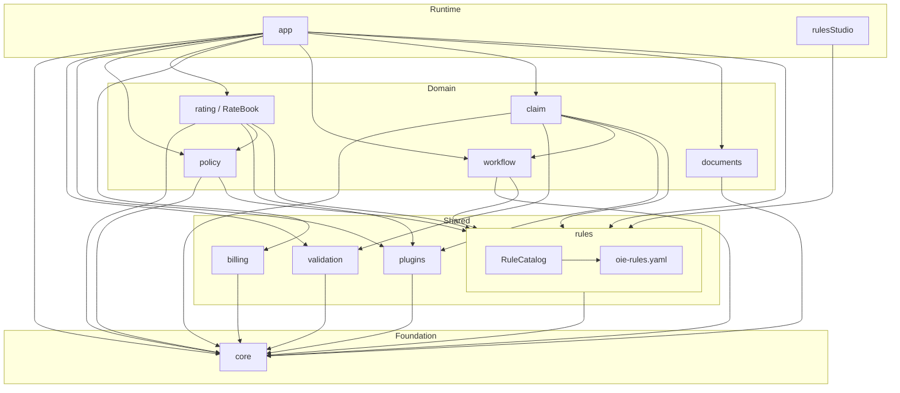
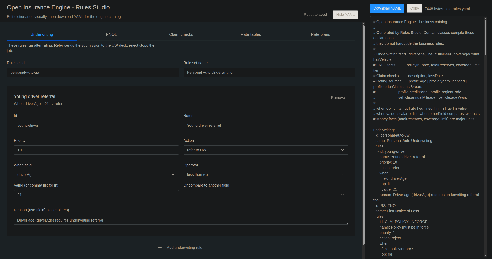

# Open Insurance Engine

A Property & Casualty (P&C) insurance core engine for financial and insurance carriers, built with **Scala 3**, **Cats Effect**, **FS2**, and in near future **Apache Kafka**.

Architecture inspired by the typical domain ecosystem with below generic modules like: `PolicyCenter`, `BillingCenter`, `ClaimCenter`. 

## Modules

| Module | Role |
|--------|------|
| `core` | Opaque IDs, Money (minor units), Time, Result, in-memory `Repository` |
| `rules` | Business rules engine (Accept / Reject / Modify / Refer) |
| `validation` | Accumulating field validation (`ValidatedNel`) |
| `plugins` | Plugin SPI (rating, underwriting, payments, fraud, documents...) |
| `policy` | New business: draft -> quote -> bind -> cancel |
| `rating` | Weighted / multiplicative rate engine, rate tables, worksheets, Personal Auto plan |
| `billing` | BillingCenter: installment invoices, bill, apply payment |
| `workflow` | Generic process engine: steps, transitions, guards, instance history |
| `claim` | ClaimCenter: FNOL, reserves, approve, pay, close / deny |
| `documents` | Document production: templates, renderers, generated files (DEC, claim ack, …) |
| `app` | Composition root and demo: submission workflow + rating + FNOL + documents |
| `rulesStudio` | Visual catalog editor: React JS, served as static HTML/JS/CSS |

### Module dependencies

Arrows mean **depends on** (sbt `dependsOn`). `core` is the shared foundation; `app` is the composition root.
`oie-rules.yaml` is the business catalog (UW, FNOL, claim checks, rate tables); `RuleCatalog` loads it, and `policy` / `claim` / `rating` consume it through `rules`. Edit it visually with **Rules Studio** (`rulesStudio`), which generates the same YAML.



## Rules and dictionaries

Business rules and rate dictionaries live in one classpath YAML file. Domain classes (`PolicyRules`, `ClaimRules`, `PersonalAutoRatePlan`) only compile it; they do not hardcode the catalog.

| | |
|--|--|
| File | `modules/rules/src/main/resources/oie-rules.yaml` |
| Loader | `RuleCatalog` (`modules/rules`) |
| Rate book | `RateBook` compiles the `rating` section into tables and plans |

**Top-level YAML keys**

| Key | What it drives |
|-----|----------------|
| `underwriting` | UW `RuleSet` (demo: `young-driver` referral if `driverAge` &lt; 21) |
| `fnol` | FNOL `RuleSet` (policy in force, reserve vs limit, high-severity refer) |
| `claimValidation` | Field checks before FNOL (`nonBlank`, `notInFuture`) |
| `rating` | Rate tables (`age`, `region`, …) and plans (`PA-WEIGHTED-PL-2026`, `PA-MULT-PL-2026`) |

Add a rule by appending an entry under `underwriting.rules` or `fnol.rules` (`action`: `reject` / `refer`, `when.field` + `op` + `value` or `otherField`). Add a tariff band under `rating.tables`. Available facts and `when.op` values are listed in the comments at the top of the YAML file.

## Rules Studio

A small http4s app that serves a React SPA so you can edit the catalog in the browser and download `oie-rules.yaml`. The server also exposes the current engine file at `GET /api/catalog.yaml`.



```bash
# first time / after UI changes
cd modules/rules-studio/frontend
npm install --legacy-peer-deps
npm run build

# from the repo root
sbt "rulesStudio/run"
```

Open [http://127.0.0.1:8080](http://127.0.0.1:8080). Tabs cover underwriting, FNOL, claim checks, rate tables, and rate plans. The right pane is a live YAML preview with **Download YAML** / **Copy**. Drop the file into `modules/rules/src/main/resources/oie-rules.yaml` for the engine to pick it up.

Frontend hot-reload (proxies `/api` to the Scala server):

```bash
cd modules/rules-studio/frontend && npm run dev
```

## Requirements

- JDK 17+
- sbt 1.10+
- Node.js 18+ (only for rebuilding Rules Studio UI)

## Running demo app

The demo binds a Personal Auto policy through the submission workflow (`draft -> rate -> underwrite -> quote -> bind`), issues policy declarations, then opens a collision FNOL and settles it (`open -> reserve -> approve -> pay -> close`) and issues a claim acknowledgement.

```bash
sbt "app/run --demo"
```

```
[info] Starting demo scenario on 2026-08-15...
[info] 23:19:10.544 [io-compute-11] INFO  c.g.b.openinsuranceengine.app.Main - Insured: age=23, licensed=3y, claims=1, credit=Standard, region=PL-MZ
[info] 23:19:10.548 [io-compute-11] INFO  c.g.b.openinsuranceengine.app.Main - === New-business workflow: New Business Submission ===
[info] 23:19:10.557 [io-compute-11] INFO  c.g.b.openinsuranceengine.app.Main - Workflow step: draft
[info] 23:19:10.562 [io-compute-11] INFO  c.g.b.openinsuranceengine.app.Main - Workflow step: rate
[info] 23:19:10.607 [io-compute-11] INFO  c.g.b.openinsuranceengine.app.Main - Workflow step: underwrite
[info] 23:19:10.621 [io-compute-11] INFO  c.g.b.openinsuranceengine.app.Main - Workflow step: quote
[info] 23:19:10.622 [io-compute-11] INFO  c.g.b.openinsuranceengine.app.Main - Workflow step: bind
[info] Created Account: 6f1fb44e-6bba-4932-81f0-475908038f9f, Party: d79c39f9-7214-4fef-85de-214e86e5b6cd
[info] Product ID: f58fd300-6287-4b6d-a72c-6fb37b7db3f2, Policy ID: 465ffd8d-970f-4c32-9075-1bc778ba3bdb
[info] Coverage: BI (Base Premium: 1000,00 PLN)
[info] Vehicle: Volkswagen Golf
[info] Rated premium: 1215,50 PLN
[info] Rate worksheet (WeightedAverage)
[info]   Base rate:      1000,00 PLN
[info]   Combined factor: 1.2155
[info]   Final premium:  1215,50 PLN
[info]   Factors:
[info]     - AGE              Driver age                   input=23           band=Youth (21-24)    factor=1,450  weight= 2,50
[info]     - EXPERIENCE       Years licensed               input=3            band=Junior (2-4y)    factor=1,200  weight= 1,50
[info]     - CLAIMS           Prior claims                 input=1            band=1 claim          factor=1,150  weight= 2,00
[info]     - CREDIT           Credit band                  input=Standard     band=Standard         factor=1,000  weight= 1,20
[info]     - REGION           Region                       input=PL-MZ        band=Mazowieckie (Warsaw) factor=1,250  weight= 1,00
[info]     - MILEAGE          Annual mileage               input=15000        band=High (15-25k)    factor=1,180  weight= 1,00
[info]     - VEHICLE_AGE      Vehicle age                  input=6            band=Mid (3-7y)       factor=1,000  weight= 0,80
[info] Workflow: Completed via draft -> rate -> underwrite -> quote -> bind
[info] Policy: status=InForce number=POL-465FFD8D
[info] 23:19:10.660 [io-compute-11] INFO  c.g.b.openinsuranceengine.app.Main - === Document production: policy declarations ===
[info] Document: DEC-POL-465FFD8D.txt type=PolicyDeclarations 291 bytes
[info] PERSONAL AUTO — POLICY DECLARATIONS
[info] Policy: POL-465FFD8D
[info] Status: InForce
[info] Line: PersonalAuto
[info] Term: 2026-08-15 / 2027-08-15
[info] Insured age: 23  licensed: 3y  region: PL-MZ
[info] Vehicle: 2020 Volkswagen Golf (WA12345)
[info] Coverages:
[info]   - BI limit=1000000,00 PLN deductible=500,00 PLN
[info] Premium: 1215,50 PLN
[info] 23:19:10.680 [io-compute-11] INFO  c.g.b.openinsuranceengine.app.Main - === First notice of loss ===
[info] Claim: CLM-303766D5 status=Closed paid=7500,00 PLN
[info] 23:19:10.707 [io-compute-11] INFO  c.g.b.openinsuranceengine.app.Main - === Document production: claim acknowledgement ===
[info] Document: ACK-CLM-303766D5.txt type=ClaimAcknowledgement 196 bytes
[info] CLAIM ACKNOWLEDGEMENT
[info] Claim: CLM-303766D5
[info] Policy: POL-465FFD8D
[info] Status: Closed
[info] Loss: Collision on 2026-08-15
[info] Location: Warsaw, PL
[info] Description: Rear-end collision, Volkswagen Golf
[info] Paid: 7500,00 PLN
[info] Services container available: Services
[info] Finished!
```

### What the demo does

The demo replays one end-to-end customer story: **new Personal Auto policy -> rating -> bind -> declarations -> collision claim and payout -> claim acknowledgement**. Everything runs in memory (in-memory repositories); there is no database and no network I/O.

There are three phases: **new business** (workflow), **document production** (declarations), then **FNOL** (claim) plus a second document (acknowledgement). Identifiers (`Account`, `Party`, `Product`, `Policy`, claim number) are random UUIDs, so they change on every run. Premium math is deterministic for this fixture.

The `Services` container also holds `BillingService`, `DocumentService`, and a registered `PolicyRatingPlugin`. **This run does not call billing.** Rating is invoked directly via `PolicyRatingPlugin.rateWithWorksheets`, not via `plugins.executeAll`. Documents are rendered through `DocumentService` with in-memory `TextDocumentRenderer` templates (`PA-DEC-PL-2026`, `PA-CLAIM-ACK-PL-2026`).

#### 0. The submission being rated

Before the workflow starts, `DemoScenario` builds a synthetic application:

- **Insured**: age 23, 3 years licensed, 1 claim in the last 3 years, credit band `Standard`, region `PL-MZ` (Mazowieckie / Warsaw)
- **Risk**: Volkswagen Golf 2020, 15 000 km/year, plate `WA12345`
- **Coverage**: `BI` (bodily injury), limit 1 000 000 PLN, deductible 500 PLN, **base tariff 1 000 PLN**
- **Term**: from today for 1 year, line of business Personal Auto, job type `Submission`

#### 1. New-business workflow: `draft -> rate -> underwrite -> quote -> bind`

`WorkflowEngine` starts the `New Business Submission` definition with a `SubmissionState` payload (policy period + insured profile; worksheets are filled later). `start` does **not** execute the first step - it only sets `currentStepId = draft`. `runUntilDone` then calls `advance` until the instance status is `Completed`.

**`draft`.** `PolicyService.createDraft` checks that at least one coverage exists and that Personal Auto has a `VehicleRisk`. The period is saved with status `Draft`.

**`rate`.** The engine applies plan `Personal Auto Weighted (PL 2026)` on top of the 1 000 PLN base. Combination mode is **weighted average**, not a product of factors.

| Factor | Input | Band | Factor | Weight |
|--------|-------|------|--------|--------|
| AGE | 23 | Youth (21-24) | 1.45 | 2.50 |
| EXPERIENCE | 3 | Junior (2-4y) | 1.20 | 1.50 |
| CLAIMS | 1 | 1 claim | 1.15 | 2.00 |
| CREDIT | Standard | Standard | 1.00 | 1.20 |
| REGION | PL-MZ | Mazowieckie (Warsaw) | 1.25 | 1.00 |
| MILEAGE | 15000 | High (15-25k) | 1.18 | 1.00 |
| VEHICLE_AGE | 6 (year − 2020) | Mid (3-7y) | 1.00 | 0.80 |

Formula: `Σ(factor × weight) / Σ(weights)` = `12.155 / 10.00` = **1.2155**.  
Premium: `1000 × 1.2155` = **1 215.50 PLN**. Youth, one prior claim, and Warsaw load the rate; vehicle age is neutral.

**`underwrite`.** Rule `young-driver` refers to UW only when age **&lt; 21**. This insured is 23, so `referred = false` and the transition goes to `quote`, not `refer`.

**`quote`.** Status `Draft` -> `Quoted` (offer, still no policy number).

**`bind`.** Status `Quoted` -> `InForce`, policy number `POL-` plus the first 8 hex chars of the policy UUID (e.g. `POL-AA4D5094`). The policy is now in force and can accept a claim.

The line `Workflow: Completed via draft -> rate -> underwrite -> quote -> bind` is the instance step history.

#### 2. Policy declarations

Right after bind, `DocumentService.render("PA-DEC-PL-2026", …)` produces a text declarations page (`DEC-POL-AA4D5094.txt`): policy number, term, insured, vehicle, BI coverage, and the rated premium **1 215.50 PLN**. This is the Guidewire-style forms engine analogue (`documents` module): a registered `TextDocumentRenderer`, not a PDF library.

#### 3. FNOL: a loss on the bound policy

`=== First notice of loss ===` opens a Golf rear-end collision in Warsaw. Loss date is today, tier `Medium`, claimant is the same `Party`.

`ClaimService` then runs:

1. **`openFnol`** - validation (non-blank description, loss date not in the future) plus FNOL rules: the policy **must be InForce** (it is), and reserves must not exceed the 1 000 000 PLN limit. Medium tier -> status `Open`, claim number `CLM-` plus 8 hex chars.
2. **`setReserve`** - `vehicle_damage` reserve of **8 500 PLN** -> `Reserved`.
3. **`approve`** -> `Approved`.
4. **`pay`** - indemnity **7 500 PLN** to the insured, reference `IND-GOLF-001` -> `Paid`.
5. **`close`** -> `Closed`.

Hence: `Claim: CLM-FE86EAED status=Closed paid=7500,00 PLN`. Reserve 8 500 vs payment 7 500 is intentional (estimate vs actual indemnity).

Then `DocumentService.render("PA-CLAIM-ACK-PL-2026", …)` issues `ACK-CLM-FE86EAED.txt`: claim number, policy, collision in Warsaw, paid **7 500.00 PLN**.

#### Paths this fixture does not take

- Billing (installment invoices / cash application) is wired in `Services` but unused.
- The `refer` branch (driver younger than 21) does not fire here.
- The registered rating plugin is not executed through the plugin registry; the workflow calls rating directly.
- Document formats other than `Text` (PDF / HTML / XML) are in the domain model but not rendered here.

In one sentence: **a young Warsaw driver with one prior claim is charged 1 215.50 PLN instead of 1 000, the policy goes in force with a declarations page, then a collision claim is opened, reserved, approved, paid (7 500 PLN), closed, and acknowledged in writing.**

## Running unit tests

```bash
sbt test

...

[info] Passed: Total 199, Failed 0, Errors 0
```


## Stack

- Scala 3.3
- Cats Effect 3
- FS2 3
- fs2-kafka
- Circe
- Decline
- log4cats
- MUnit
- http4s (Rules Studio serving layer)
- React JS (Rules Studio UI)

## TBD
