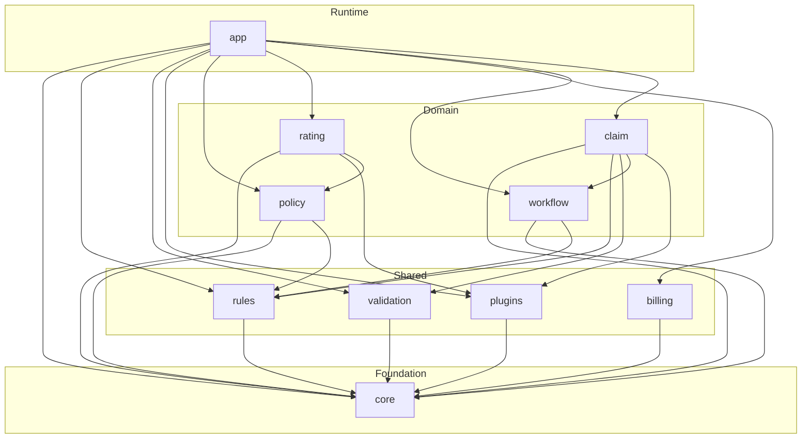

# Open Insurance Engine

A Property & Casualty (P&C) insurance core engine for financial and insurance carriers, built with **Scala 3**, **Cats Effect**, **FS2**, and in near future **Apache Kafka**.

Architecture inspired by the typical domain ecosystem with below generic modules like: `PolicyCenter`, `BillingCenter`, `ClaimCenter`. 

## Modules

| Module | Role |
|--------|------|
| `core` | Opaque IDs, Money (minor units), Time, Result, in-memory `Repository` |
| `rules` | Business rules engine (Accept / Reject / Modify / Refer) |
| `validation` | Accumulating field validation (`ValidatedNel`) |
| `plugins` | Plugin SPI (rating, underwriting, payments, fraud, documents...) |
| `policy` | New business: draft → quote → bind → cancel |
| `rating` | Weighted / multiplicative rate engine, rate tables, worksheets, Personal Auto plan |
| `billing` | BillingCenter: installment invoices, bill, apply payment |
| `workflow` | Generic process engine: steps, transitions, guards, instance history |
| `claim` | ClaimCenter: FNOL, reserves, approve, pay, close / deny |
| `app` | Composition root and demo: submission workflow + rating + FNOL |

### Module dependencies

Arrows mean **depends on** (sbt `dependsOn`). `core` is the shared foundation; `app` is the composition root.



## Requirements

- JDK 17+
- sbt 1.10+

## Running demo app

The demo binds a Personal Auto policy through the submission workflow (`draft → rate → underwrite → quote → bind`), then opens a collision FNOL and settles it (`open → reserve → approve → pay → close`).

```bash
sbt "app/run --demo"
```

```
[info] Starting demo scenario on 2026-08-14...
[info] === New-business workflow: New Business Submission ===
[info] Workflow step: draft
[info] Workflow step: rate
[info] Workflow step: underwrite
[info] Workflow step: quote
[info] Workflow step: bind
[info] Coverage: BI (Base Premium: 1000,00 PLN)
[info] Vehicle: Volkswagen Golf
[info] Rated premium: 1215,50 PLN
[info] Workflow: Completed via draft -> rate -> underwrite -> quote -> bind
[info] Policy: status=InForce number=POL-9EE21C0C
[info] === First notice of loss ===
[info] Claim: CLM-55C0811F status=Closed paid=7500,00 PLN
[info] Finished!
```

## Running unit tests

```bash
sbt test

...

[info] Passed: Total 68, Failed 0, Errors 0, Passed 68
```


## Stack

- Scala 3.3
- Cats Effect 3
- FS2 3
- fs2-kafka
- Circe
- Decline
- log4cats
- MUnit

## TBD
